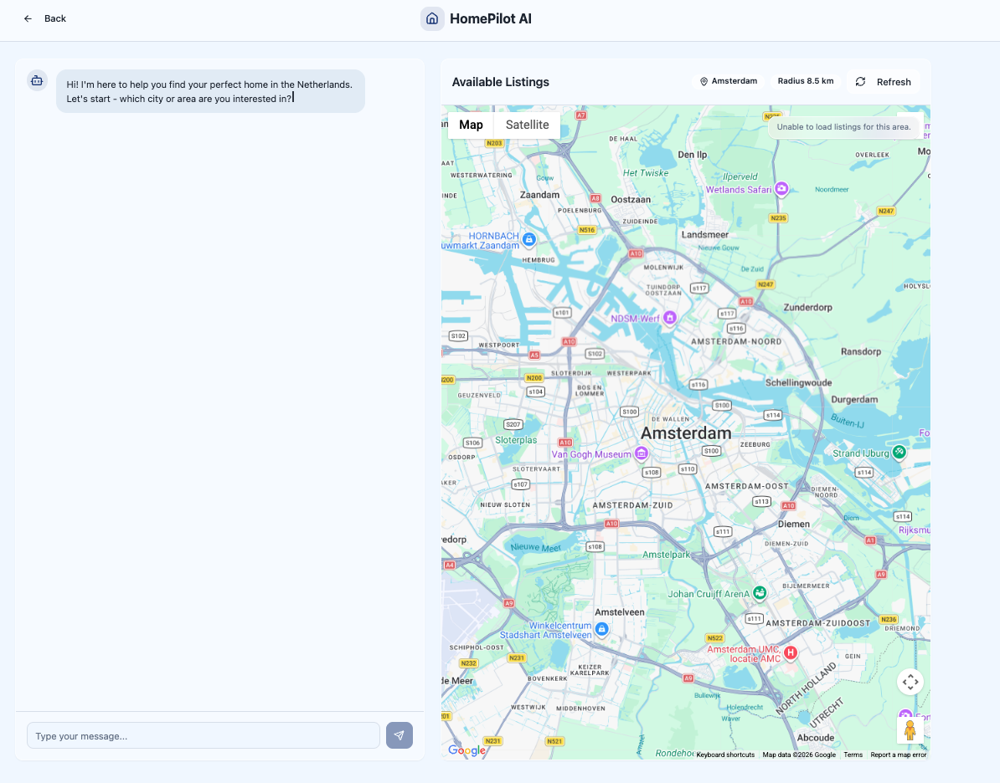

# HomePilot

HomePilot is an AI-powered housing assistant built for the Dutch rental market. It connects listing collection, data ingestion, geocoding, conversational search, commute-aware ranking, and automated applications into one workflow so users can discover relevant homes faster and apply with less manual work.




## What This Project Does

This repository is designed to solve a practical problem in the Netherlands rental market: listings are fragmented across platforms, good homes move quickly, and filtering manually is expensive in both time and attention.

HomePilot currently combines four main capabilities:

1. `Scraper`
   Collects rental listings from housing platforms, currently focused on Pararius.
2. `Backend API`
   Stores listings in SQLite, geocodes addresses, exposes filtering endpoints, and provides agent-related APIs.
3. `AI Agent Workflow`
   Uses CrewAI to coordinate conversational search, listing retrieval, ranking, motivation-letter generation, and automated application steps.
4. `Frontend`
   Provides a React-based chat and map interface so users can describe what they want and immediately inspect the selected listings.

## Core Flow

```text
Scraper -> /ingest-listings -> SQLite listings DB -> /listings API
                                         |
                                         v
                              AI Agents / Conversation Memory
                                         |
                                         v
                              Frontend Chat + Map UI
                                         |
                                         v
                              Auto Apply + Screenshot Proof
```

In practice, the flow looks like this:

1. The scraper collects listing data.
2. The backend receives structured listings and stores them in SQLite.
3. The backend geocodes addresses using Google Geocoding and caches the results.
4. The frontend lets users describe their needs in natural language, such as city, budget, size, and commute target.
5. The conversation agent collects the criteria and asks for confirmation.
6. The search agent pulls matching listings from `/listings`.
7. The ranking agent ranks listings based on search constraints and commute information.
8. Once a user chooses a listing, the apply agent can generate a motivation letter and submit an application.
9. The system stores a screenshot as application proof for follow-up tracking.

## Current Features

- Conversational housing search
- Map-based listing exploration
- Listing filters
- SQLite-backed listing storage
- Address geocoding and radius-based search
- Async job status polling
- Multi-step AI agent search and ranking
- Automatic motivation letter generation
- Automated Pararius contact form submission
- Application screenshot capture and status tracking
- Docker Compose startup for the full stack

## Tech Stack

### Frontend

- React 18
- TypeScript
- Vite
- Tailwind CSS
- shadcn/ui
- Google Maps (`@vis.gl/react-google-maps`)

### Backend

- FastAPI
- SQLite
- httpx
- Pydantic

### Agent / Automation

- CrewAI
- OpenAI API
- Google Maps API
- Selenium
- webdriver-manager

### Scraper

- Python
- BeautifulSoup4
- lxml

## Repository Structure

```text
.
├── backend/                # FastAPI + SQLite API
├── frontend/               # React UI
├── scraper/                # Housing scraper
├── src/                    # CrewAI agents / tasks / tools / memory
├── docker/                 # Dockerfiles
├── docker-compose.yml      # Local full-stack startup
├── deploy.sh               # Docker Compose deployment script
├── verify.sh               # Post-deploy verification script
└── docs/                   # Assets used by the README
```

Key modules:

- `backend/api.py`
  Main API entrypoint, including listings, chat, apply, and job-status endpoints.
- `backend/db.py`
  SQLite schema initialization and lightweight migrations.
- `src/crew_factory.py`
  Builds different crews such as `housing_search`, `housing_apply`, and `conversation`.
- `src/tasks/housing_tasks.py`
  Defines the search, ranking, and application tasks.
- `src/tools/`
  Contains backend query, commute calculation, ranking, motivation builder, and form automation tools.
- `scraper/src/hunters/pararius.py`
  Pararius extraction logic.
- `frontend/src/components/search-assistant/`
  Main chat and map UI components.

## System Architecture

### 1. Scraper

The scraper extracts structured housing data such as:

- title
- price
- address
- area
- housing type
- furnishing status
- deposit
- agency details
- first seen timestamp
- thumbnail path

Currently implemented:

- `Pararius`

Scaffolding already exists for:

- `Gruno`
- `Kamernet`
- `Wonen123`

### 2. Backend API

The backend is responsible for four main tasks:

1. Accepting listing data from the scraper
2. Writing that data into SQLite and geocoding addresses
3. Exposing query and filtering APIs
4. Providing AI-agent search, chat, and application endpoints

Important tables:

- `listings`
  Main listing table with searchable columns, coordinates, raw JSON, and application state.
- `address_cache`
  Geocoding cache.
- `llm_jobs`
  Async job state for search and application workflows.

### 3. AI Agents

The agent workflow currently follows three main paths:

1. `conversation`
   Talks to the user, collects search criteria, and asks for confirmation when needed.
2. `housing_search`
   Retrieves listings and ranks them when necessary.
3. `housing_apply`
   Generates motivation letters and automates application submission.

Agent roles:

- `Master Agent`
  Collects criteria, confirms intent, and decides when search can be triggered.
- `Search Agent`
  Pulls matching listings from the backend API.
- `Ranking Agent`
  Computes commute times and ranking.
- `Apply Agent`
  Generates a motivation letter, fills the form, and saves a screenshot.

### 4. Frontend

The frontend currently exposes two main user paths:

1. `Landing Page`
   Introduces the product and routes users into the search flow.
2. `Search Assistant`
   A split-screen experience with chat on the left and the map on the right, so users can describe preferences while inspecting results visually.

## How Users Interact With It

### Conversational Search

Users can type natural-language requests such as:

```text
I want a furnished apartment in Leiden under €1800, at least 45m², with a commute to Amsterdam Central.
```

The system extracts criteria step by step and triggers search once the request is complete and confirmed.

### Using a Listing URL as Input

If a chat message contains a property URL, the system first analyzes the page and tries to extract:

- city
- rent
- size
- an inferred commute target

It then asks the user whether they want to search for similar properties.

### Map Exploration

The map view:

- geocodes the target city or area
- fetches nearby listings automatically
- supports price, pet, and minimum-area filtering
- prioritizes agent-selected results if the agent has already produced a shortlist

### Automated Application

Once a listing is selected, the system can:

1. generate a motivation letter from the user profile
2. open the listing contact page
3. fill the application form automatically
4. save a submission screenshot
5. write the application state back to the database

## Requirements

- Node.js 18+
- npm 9+
- Python 3.10+
- A virtual environment is recommended
- Docker and Docker Compose

To use the full AI and map workflow, you also need:

- OpenAI API key
- Google Maps API key

## Environment Variables

Create a `.env` file in the repository root.

A typical local setup looks like this:

```env
OPENAI_API_KEY=your_openai_api_key
GOOGLE_MAPS_API_KEY=your_google_maps_api_key
BACKEND_BASE_URL=http://localhost:8000
VITE_API_BASE_URL=http://localhost:8000
DB_PATH=./.data/housing.db
SCRAPER_VERSION=homepilot-local
SLEEP_SECONDS=60
```

Common variables:

| Variable | Purpose |
| --- | --- |
| `OPENAI_API_KEY` | Enables CrewAI and agent features |
| `GOOGLE_MAPS_API_KEY` | Enables geocoding, commute, and map features |
| `BACKEND_BASE_URL` | Used by backend-facing agent tools |
| `VITE_API_BASE_URL` | Used by the frontend to call the backend |
| `DB_PATH` | SQLite database location |
| `SCRAPER_VERSION` | Version tag stored in scrape metadata |
| `SLEEP_SECONDS` | Interval between scraper runs |
| `MINIMUM_PRICE` | Lower bound used by the scraper |
| `MAXIMUM_PRICE` | Upper bound used by the scraper |

## Local Development

### Option 1: Start Services Manually

#### 1. Start the backend

```bash
cd backend
python -m venv .venv
source .venv/bin/activate
pip install -r requirements.txt
uvicorn api:app --reload --host 0.0.0.0 --port 8000
```

#### 2. Start the frontend

```bash
cd frontend
npm install
npm run dev
```

The frontend is available at:

- `http://localhost:5173`

#### 3. Start the scraper

```bash
cd scraper
python -m venv .venv
source .venv/bin/activate
pip install -r requirements.txt
python -m src.main --once
```

For continuous polling:

```bash
python -m src.main
```

### Option 2: Docker Compose

This is the closest setup to the full integrated system.

```bash
docker compose up --build
```

Included services:

- `backend`
- `scraper`
- `datasette`
- `nginx`

Default entrypoints:

- App: `http://localhost/`
- Backend API: `http://localhost/api/...`
- Datasette: `http://localhost:8001`

If you want to use the provided deployment script:

```bash
./deploy.sh
```

After deployment, verify the stack with:

```bash
./verify.sh
```

## API Overview

### Listings

- `POST /ingest-listings`
  Batch-ingests listing data.
- `GET /listings`
  Queries listings by city, price, area, radius, and more.
- `GET /listing/{listing_id}`
  Fetches a single listing by internal or external ID.

### Jobs

- `POST /llm/start`
- `POST /llm/finish`
- `GET /llm/status`
- `GET /jobs/status/{job_id}`

These endpoints are mainly used to track asynchronous search and application workflows.

### Agent

- `POST /agent/housing/search`
  Directly triggers AI-powered housing search.
- `POST /agent/housing/chat`
  Entry point for conversational search.
- `POST /agent/housing/apply`
  Starts the automated application flow for a single listing.

## API Examples

### Ingest listings

```bash
curl -X POST http://localhost:8000/ingest-listings \
  -H "Content-Type: application/json" \
  -d '[
    {
      "id": "pararius-123",
      "url": "https://example.com/listing/123",
      "title": "Apartment in Amsterdam",
      "price": { "amount": 1800, "frequency": "month" },
      "area_m2": 55,
      "address": { "street": "Example Straat 1", "city": "Amsterdam", "postal_code": "1011AB" }
    }
  ]'
```

### Query listings

```bash
curl "http://localhost:8000/listings?city=Amsterdam&max_price=2000&min_area=45&limit=10"
```

### Conversational search

```bash
curl -X POST http://localhost:8000/agent/housing/chat \
  -H "Content-Type: application/json" \
  -d '{
    "message": "I need an apartment in Utrecht under 1800 euros, at least 45 square meters, commuting to Utrecht Central"
  }'
```

### Start an application

```bash
curl -X POST http://localhost:8000/agent/housing/apply \
  -H "Content-Type: application/json" \
  -d '{
    "user_profile": {
      "username": "your_email",
      "password": "your_password",
      "full_name": "Your Name"
    },
    "listing_details": {
      "external_id": "pararius-123",
      "contact_url": "https://www.pararius.com/contact/..."
    }
  }'
```

## Frontend Usage

1. Open the landing page.
2. Click `Start Searching`.
3. Enter city, budget, size, and commute preferences in the chat.
4. The agent collects the criteria and asks for confirmation.
5. Once search completes, the shortlist appears on the map.
6. Click a listing to inspect details.
7. If the application flow is completed, the screenshot path and application status are stored.

## Database Design Notes

The `listings` table stores:

- core listing fields
- queryable fields such as `price_amount`, `area_m2`, and `city`
- geocoded `latitude` / `longitude`
- `raw_json`
- `application_status`
- `application_screenshot_path`

This design balances:

- query efficiency
- raw data preservation
- follow-up tracking for applications

## Ranking Logic

The current `housing_search` crew behaves as follows:

1. The search agent pulls up to 10 matching listings from the backend.
2. If the result set is `<= 10`, the workflow currently assigns `match_score=100` to all items and skips expensive ranking.
3. If there are more results, the ranking agent calls the commute and ranking tools.
4. The ranked output is returned to the frontend for display.

The key tradeoff here is speed over exhaustive ranking for small result sets.

## Application Workflow

The automated application flow currently works like this:

1. The frontend sends `user_profile` and `listing_details`
2. The backend creates a background job
3. The apply agent generates a motivation letter
4. A Selenium-based tool logs in and fills the form
5. A submission screenshot is saved
6. The backend updates:
   - `application_status`
   - `application_screenshot_path`

## Where to Put Screenshots

The README already contains a screenshot block. To replace it with your actual product screenshot:

1. Put your screenshot at `docs/screenshot.png`
2. Change this line in the README:

```md

```

to:

```md

```

If you want multiple screenshots later, you can also add:

- `docs/home.png`
- `docs/chat.png`
- `docs/map.png`

## Known Limitations

- Full agent functionality depends on `OPENAI_API_KEY`
- Geocoding and map functionality depend on `GOOGLE_MAPS_API_KEY`
- The automated application flow is currently strongly tailored to Pararius
- The ranking task intentionally skips full ranking for small result sets to prioritize speed
- The frontend still shows signs of a Google Maps key being embedded in code; this should be moved to environment-based configuration before production use

## Recommended Next Steps

- Move the Google Maps key out of frontend source code and into secure configuration
- Add more scraper sources
- Expand tests and CI coverage
- Add real user-profile management and authentication
- Turn the application workflow into a fuller tracking dashboard

## Reference Files

- [backend/api.py](/Users/chiehlee/Desktop/Career/hackthon/prosus-agent-hackathon/backend/api.py)
- [backend/db.py](/Users/chiehlee/Desktop/Career/hackthon/prosus-agent-hackathon/backend/db.py)
- [src/crew_factory.py](/Users/chiehlee/Desktop/Career/hackthon/prosus-agent-hackathon/src/crew_factory.py)
- [src/tasks/housing_tasks.py](/Users/chiehlee/Desktop/Career/hackthon/prosus-agent-hackathon/src/tasks/housing_tasks.py)
- [scraper/src/hunters/pararius.py](/Users/chiehlee/Desktop/Career/hackthon/prosus-agent-hackathon/scraper/src/hunters/pararius.py)
- [frontend/src/pages/SearchAssistant.tsx](/Users/chiehlee/Desktop/Career/hackthon/prosus-agent-hackathon/frontend/src/pages/SearchAssistant.tsx)
- [frontend/src/components/search-assistant/ChatInterface.tsx](/Users/chiehlee/Desktop/Career/hackthon/prosus-agent-hackathon/frontend/src/components/search-assistant/ChatInterface.tsx)
- [frontend/src/components/search-assistant/MapView.tsx](/Users/chiehlee/Desktop/Career/hackthon/prosus-agent-hackathon/frontend/src/components/search-assistant/MapView.tsx)
